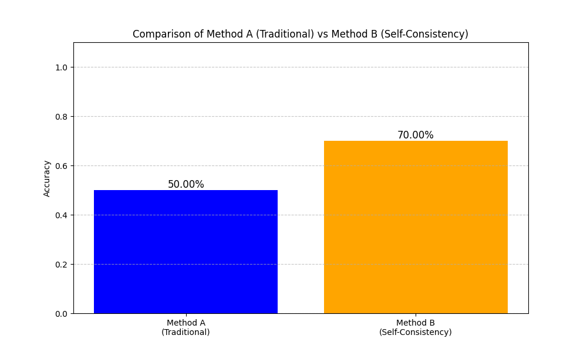

# 🧠 Self-Consistency Experiment



## 🎯 Project Overview

This project investigates whether **asking an AI multiple times** and taking a **majority vote** (Self-Consistency) produces more accurate answers than **asking once carefully** (Traditional approach) on mathematical reasoning problems.

### 🔎 Two Methods Compared:
1. **Method A (Traditional)**: 🧮 Ask AI once with temperature=0 to solve carefully
2. **Method B (Self-Consistency)**: 🔄 Ask AI 10 times with temperature=1.0 and take majority vote

## ✨ Key Results

| Method | Accuracy | Correct / Total |
|--------|----------|----------------|
| Method A (Traditional) | 50% | 5/10 |
| Method B (Self-Consistency) | 70% | 7/10 |

**Conclusion**: The self-consistency approach (Method B) improved accuracy by 20 percentage points! 🚀

## 📋 Project Structure
- `self_consistency.py`: Main script implementing both methods
- `problems.json`: Contains 10 GRE-style math problems and their correct answers
- `requirements.txt`: Python dependencies
- `setup_check.py`: Verifies API connection and environment setup
- `results.json`: Detailed results of each problem
- `accuracy.png`: Chart comparing the accuracy of both methods
- `summary.md`: Detailed summary of results

## 🛠️ Setup

1. **Install dependencies**:
```
pip install -r requirements.txt
```

2. **Create a .env file**:
```
# Example .env file
GOOGLE_API_KEY=your_api_key_here
```

3. **Get a Google Generative AI API key** from [Google AI Studio](https://ai.google.dev/) and add it to the .env file

## 🚀 Running the Experiment

Execute the main script:
```
python self_consistency.py
```

This will:
1. 📥 Load problems from problems.json
2. 🧮 For each problem:
   - Run Method A: Ask AI once with temperature=0
   - Run Method B: Ask AI 10 times with temperature=1.0 and take majority vote
   - Compare results against correct answers
3. 📊 Calculate overall accuracy for each method
4. 📈 Generate a bar chart comparing the accuracy (saved as accuracy.png)
5. 💾 Save detailed results to results.json

## 🔍 Problem-by-Problem Results

| Problem # | Method A | Method B | Winner |
|-----------|----------|----------|--------|
| 1: x² + y² where x+y=10, xy=21 | ✅ Correct | ✅ Correct | Tie |
| 2: Train average speed | ✅ Correct | ✅ Correct | Tie |
| 3: Sarah's apples | ✅ Correct | ✅ Correct | Tie |
| 4: Rain probability | ✅ Correct | ✅ Correct | Tie |
| 5: Tile calculation | ❌ Wrong | ❌ Wrong | Tie |
| 6: System of equations | ❌ Wrong | ❌ Wrong | Tie |
| 7: Notebooks pricing | ❌ Wrong | ✅ Correct | Method B |
| 8: Consecutive integers | ✅ Correct | ✅ Correct | Tie |
| 9: Alcohol solution | ❌ Wrong | ❌ Wrong | Tie |
| 10: Logarithm equation | ❌ Wrong | ✅ Correct | Method B |

## 📝 Why This Works

Self-consistency leverages the idea that AI might approach problems differently each time with temperature > 0. By aggregating multiple attempts, we're more likely to get the correct answer as the majority vote, even if some individual attempts are wrong.

This is similar to "ensemble methods" in machine learning, where combining multiple models often outperforms a single model.

## 🔬 Further Research
- Try different temperature settings
- Test on more complex problems
- Experiment with different prompt engineering techniques
- Investigate why certain problems are solved incorrectly by both methods

## 📜 Citation

This project implements the self-consistency technique described in:
> Wang, Xuezhi, et al. "Self-consistency improves chain of thought reasoning in language models." arXiv preprint arXiv:2203.11171 (2022). 